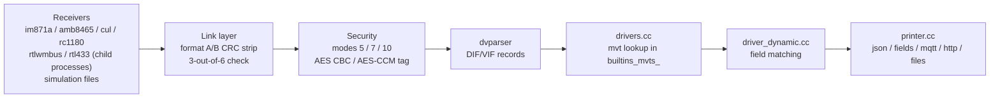

# Telegram data flow

End to end path of one telegram. Receiver abstraction and SDR child
processes are decision 0004.

The sequence of the security step is shown in
[decode-security.md](decode-security.md).