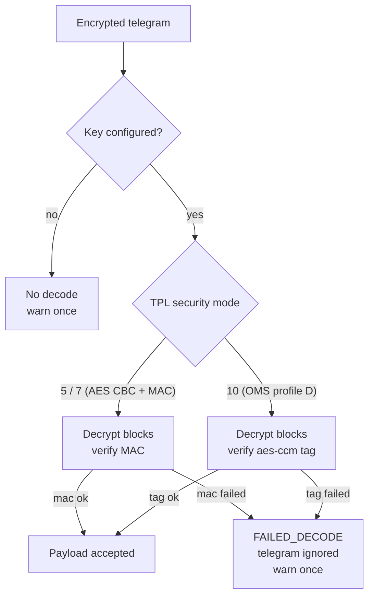

# Decode security (modes 5, 7 and 10)

Fail-closed behaviour with once-per-telegram warnings, decision 0002.

Real telegrams for both paths live in `drivers/src/kamwater.xmq` and in
`tests/test_qwds_walkby_nokey.sh`.