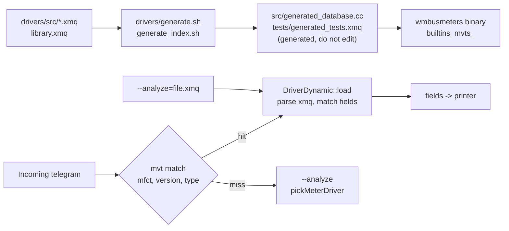

# Driver pipeline

Build-time generation and runtime load of meter drivers, decision 0003.

`library.xmq` provides shared field definitions installed into the C++
code at build time (work in progress).