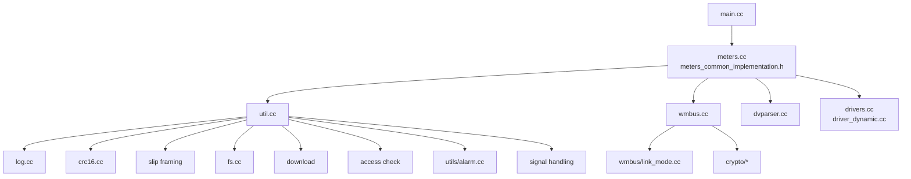

# Module structure

One binary; structure grew by extracting modules from `util.cc`,
decision 0006.

```mermaid
flowchart TD
    MAIN["main.cc"] --> CORE["meters.cc<br/>meters_common_implementation.h"]
    CORE --> UTIL["util.cc"]
    CORE --> WMB["wmbus.cc"]
    CORE --> DVP["dvparser.cc"]
    CORE --> DRV["drivers.cc<br/>driver_dynamic.cc"]
    WMB --> LM["wmbus/link_mode.cc"]
    WMB --> CRY["crypto/*"]
    UTIL --> LOG["log.cc"]
    UTIL --> CRC["crc16.cc"]
    UTIL --> SLIP["slip framing"]
    UTIL --> FS["fs.cc"]
    UTIL --> DL["download"]
    UTIL --> AC["access check"]
    UTIL --> AL["utils/alarm.cc"]
    UTIL --> SIG["signal handling"]
```

Each extraction was a standalone `chore:` commit; see decision 0006 for
the hash list.